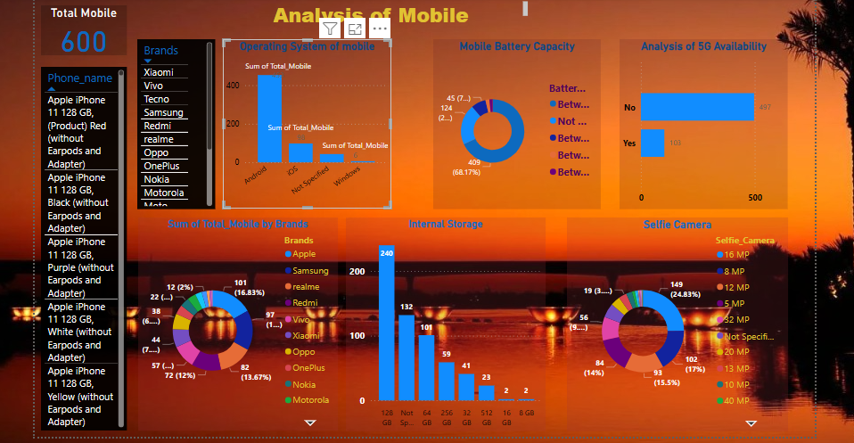

# Mobile-Phone-brand-comparison-analysis
The purpose of this analysis is to collect, organize, and evaluate data on mobile phones, focusing on their features and pricing to uncover trends related to price and performance. The main objectives are to examine the features and prices of different phones, identify the most expensive and most affordable models, spotlight top Samsung devices, and compile a list of premium Android phones. This analysis will leverage Excel for data management, SQL for advanced querying, and Power BI for insightful visualization and reporting, ensuring an efficient and clear understanding of the data.

